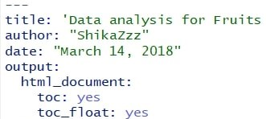

# food-nutrients-data-analysis
This project is about the analysis of food nutrients data, with a focus on potassium and phosphorus.

:arrow_up Above is part of my code written in R and generated using R Markdown. 
:arrow_down Below are some pieces of code mainly for data visualization. Hope you find them turn out to be useful some time. 

## floating content table for R Markdown

Add `toc_float: yes` under your Rmarkdown format on the very top of the code.
example:


```R
output:
  html_document:
    toc: yes
    toc_float: yes
```

## making tables

__Packages__: `knitr` ・ `kableExtra` ・ `data.table`
```R
DT_df_new<-as.data.table(df_new)
setkey(DT_df_new, food_category)
max_pho_all = DT_df_new[ , j = list(food_name = metric_category_name[which(phosphorus == max(phosphorus))],phosphorus = max(phosphorus) ), by = food_category]

min_pho_all = DT_df_new[ , j = list(food_name = metric_category_name[which(phosphorus == min(phosphorus))],phosphorus = min(phosphorus)), by = food_category]

stat_pho_min_tbl = kable(min_pho_all, "html") %>%
  kable_styling(bootstrap_options = c("striped", "hover", "responsive"), position = "left")
stat_pho_min_tbl
```
## graphs
__Packages__: `plotly`

```R
#boxplot
box_title = paste("boxplot of phosphorus (mg) in",food_cate_use, "(", serving_size, ")" )

plot_ly(y = df_new$phosphorus, type = "box", hoverinfo = df_new$metric_category_name + df_new$phosphorus, marker = list(
                       color = 'rgba(102, 205, 170, .6)',
                       line = list(color = 'rgba(46, 139, 87, .9)',
                                   width = 1)))%>%
  layout(title = box_title,
         yaxis = list(title = "phosphorus"))


#histogram
hist_title = paste("histogram of phosphorus (mg) in", food_cate_use,"(", serving_size, ")" )
plot_ly(x = df_new$phosphorus, type = "histogram",
        marker = list(
                       color = 'rgba(102, 205, 170, .6)',
                       line = list(color = 'rgba(46, 139, 87, .9)',
                                   width = 1)))%>%
  layout(title = hist_title,
                 yaxis = list(zeroline=FALSE, title = "frequency"),
                 xaxis= list(title = "phosphorus (mg)"))

#scatterplot
scatter_title = paste("phosphorus (mg) in", food_cate_use,"(", serving_size, ")" )

plot_ly(data = df_new, x= ~ metric_category_name, y = ~phosphorus, type = "scatter", name = "phosphorus of food" , mode = "markers",
        marker = list(size = 8,
                       color = 'rgba(102, 205, 170, .6)',
                       line = list(color = 'rgba(46, 139, 87, .9)',
                                   width = 1)))%>%
  add_trace(y = median(df_new$phosphorus), name = "median", mode = "lines")%>%
          layout(title = scatter_title,
                 yaxis = list(zeroline=FALSE),
                 xaxis= list(title = "food",visible = FALSE),
                  width = 900)
```
